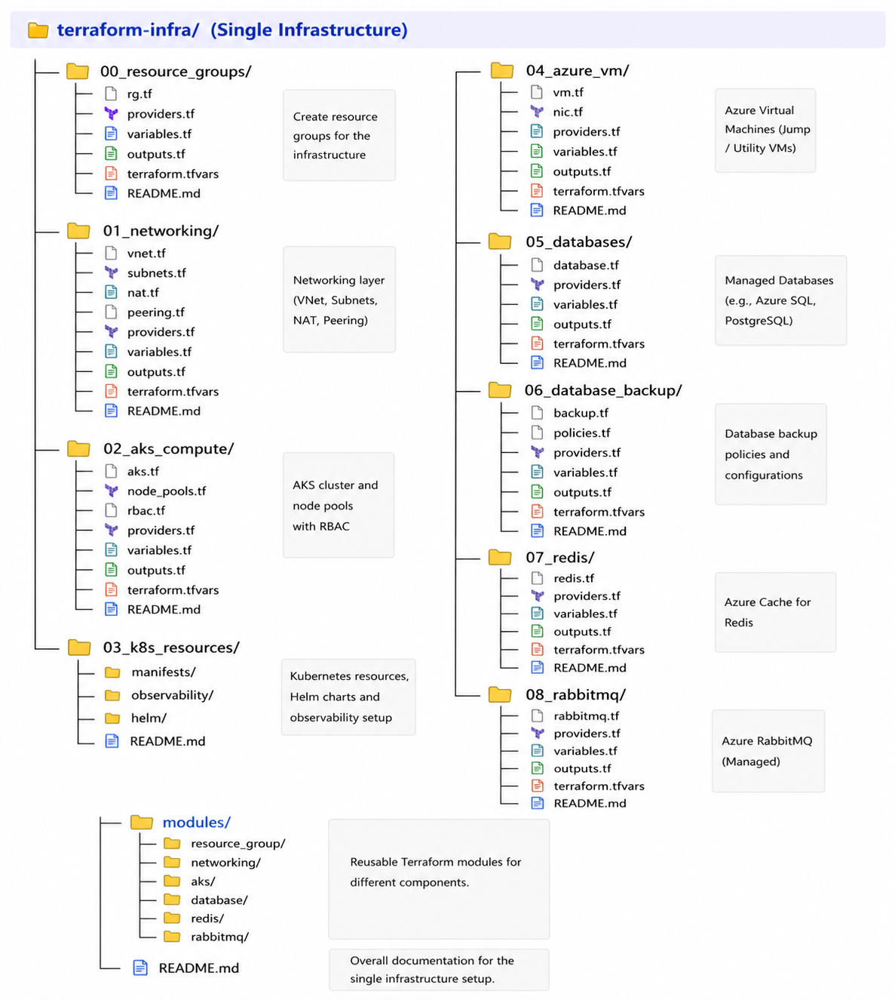
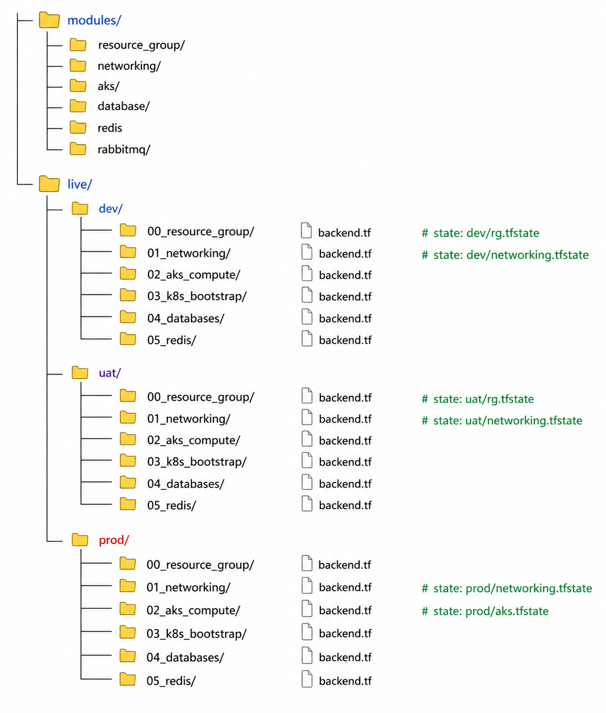
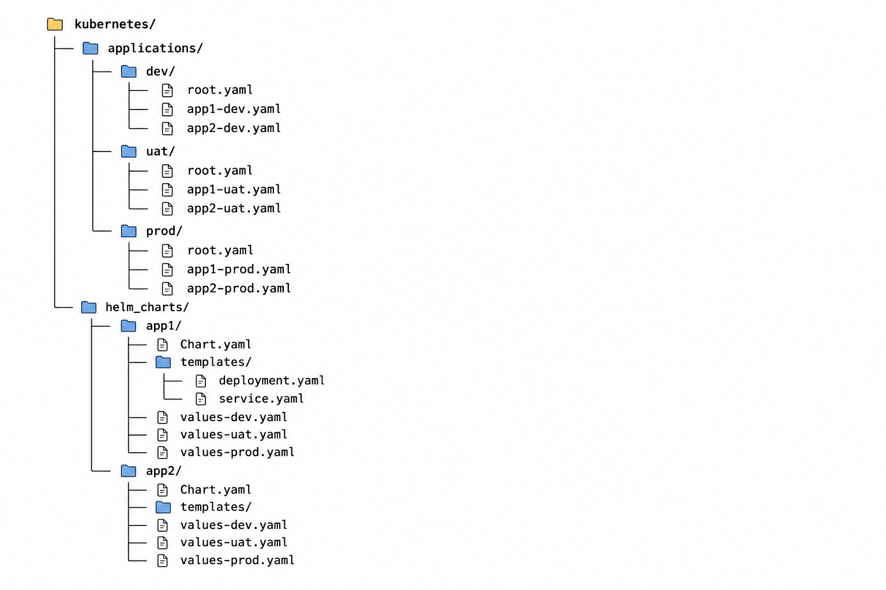

# 🚀 Real-World Infrastructure & GitOps: The "App of Apps" Pattern

As a Senior DevOps Engineer, managing environments requires absolute precision. To do this, we structure our Terraform Infrastructure and our Kubernetes GitOps repositories very specifically.

## 🏗️ 1. Infrastructure Layer: Terraform Models

We handle the cloud infrastructure in two ways depending on the company size.

A. Single Infrastructure Model (Cost-Saving / Layered Approach)

This is for when we use one physical AKS cluster and logically separate our environments. We split our code into distinct layers so our state files remain small and secure.



B. Multi-Env Infrastructure Model (Enterprise Approach)

For strict isolation (Zero Blast Radius), large companies build completely separate AKS clusters for Dev, UAT, and Prod. We use a modules/ folder so we don't duplicate code.



## 🐙 2. Application Layer: The "App of Apps" GitOps Pattern

To deploy our applications cleanly without making a mess, we use the App of Apps pattern. We separate our manifests by environment folders (dev/, uat/, prod/). Inside each folder, we have a root.yaml (Parent App). When we apply the root.yaml, it automatically detects and deploys all the Child Apps (like app1-uat.yaml) sitting next to it.



### 3. How the "App of Apps" Actually Works

The Parent App (applications/uat/root.yaml)

This is the master controller for the UAT environment. It points to the applications/uat folder in Git. When it syncs, it reads all the Child App YAMLs in that folder and creates them in ArgoCD.

```yaml
apiVersion: argoproj.io/v1alpha1
kind: Application
metadata:
  name: root-uat
  namespace: argocd
spec:
  project: default
  destination:
    namespace: argocd
    name: in-cluster
  source:
    repoURL: git@github.com:YourCompany/kubernetes.git
    targetRevision: main
    path: applications/uat
  syncPolicy:
    automated:
      prune: true
      selfHeal: true
```

The Child App (applications/uat/app1-uat.yaml)

Once the Root App creates this Child App, this file tells ArgoCD exactly which Helm chart to use and which values file to inject.

```yaml
apiVersion: argoproj.io/v1alpha1
kind: Application
metadata:
  name: app1-uat
  namespace: argocd
spec:
  project: default
  destination:
    namespace: uat                
    name: in-cluster
  source:
    repoURL: git@github.com:YourCompany/kubernetes.git
    targetRevision: main
    path: helm_charts/app1        
    helm:
      valueFiles:
        - values-uat.yaml         
  syncPolicy:
    automated:
      prune: true
      selfHeal: true
    syncOptions:
      - CreateNamespace=true
```

If developers create a brand new microservice (app3), you don't need to manually click through the ArgoCD UI to add it. You just drop the app3-uat.yaml file into the applications/uat/ folder. The root.yaml Parent App will instantly detect it and deploy the new service automatically!